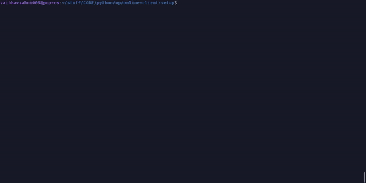

# Server Client Setup

___

## Goal

We setup a server which is capable of hosting two clients simultaneously and exchange data in real-time. This opens the possibility of making an online game.

 

 This code can be used as a basic template for online apps and games which require real-time data exchanging.

### To run this:

* Change server ip variable to your server ip4 which could be found out by using `ipconfig` in windows or `ifconfig` in linux.
* Change port variable from 5555 to something else if its not available/open on your server machine and you are getting a socket error.
* You need to change above variables in bot network.py and server.py.