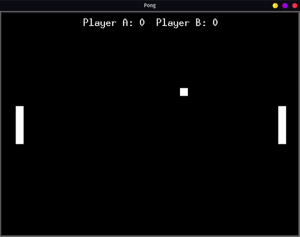

# Pong

___

## Goal

Classic Pong game with arrow up down and W S as controls.

### Future Improvements:

* More sounds
* Better ball moving mechanism rather than depending on system speed
* Rely on recursion with ontimer as well turtle forward rather manually updating positions
*  Calibrate collisions in better way

### To run on different Os:

* __Mac__ change aplay to afplay
* __Windows__ use winsound.PlaySound('bounce.wav', winsound.SND_FILENAME)

